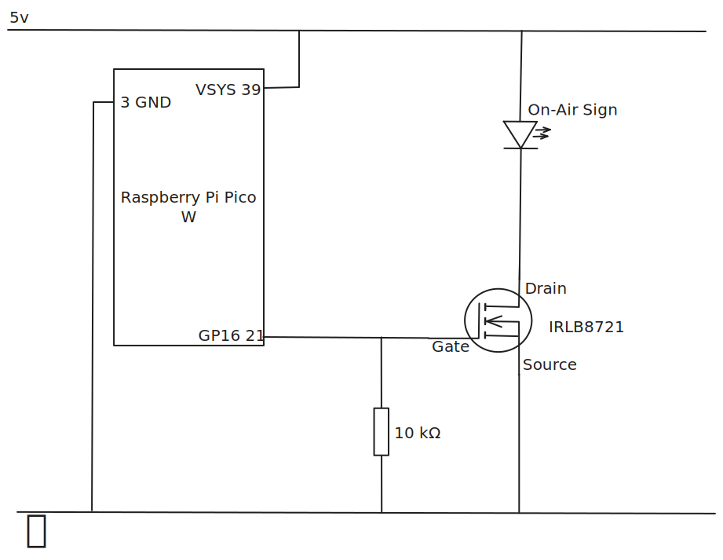

This project is a simple solution to control an "On Air" sign using a Raspberry
Pi Pico W GPIO pin. The use case is where you want to notify people around you
that you are recording video or in an online meeting.

It is designed for a Linux PC or laptop where the Webcam uses /dev/video0. A
raspberry pi pico W or similar is used to host an API connected to a GPIO pin
which controls the driver circuit for the sign.

The on-air shell script is used to monitor the state of the /dev/video0 device
using lsof. If the device is in use, then a call is made to a REST API on the
raspberry pi to notify that the video device is active.

The main script on the raspberry pi provides a REST API to control the GPIO pin.
A simple POST request can control the state of the GPIO pin.

Example POST request body to turn the GPIO pin on:

``` json
{
    "on_air": true
}
```

# Installation On Linux Laptop / PC

Adjust the path to the on-air script in the service file. It assumes
/opt/on-air.

1. Copy the service files to systemd:
```bash
sudo cp on-air.service /etc/systemd/system/
sudo systemctl daemon-reload
sudo systemctl enable on-air
sudo systemctl start on-air
```

2. Verify the service is running:
```bash
sudo systemctl status on-air
```

## Configuration

Edit the `API_HOST` variable in the `on-air` script to match your Raspberry Pi's hostname or IP address.

## Troubleshooting

Check service logs:
```bash
# On Laptop
journalctl -u on-air -f
```

# Raspberry Pi Pico W On Air Controller

This project implements a simple REST API on a Raspberry Pi Pico W that controls
an "On Air" status indicator using a GPIO pin.

## Features

- WiFi connectivity
- REST API endpoint for controlling On Air status
- GPIO control for visual indicator
- JSON-based communication

## Setup

It will help to read the online getting started guide first.
https://projects.raspberrypi.org/en/projects/get-started-pico-w

1. Flash MicroPython to your Raspberry Pi Pico W
   - Download the latest MicroPython firmware from
     [micropython.org](https://micropython.org/download/RPI_PICO_W/)
   - Hold the BOOTSEL button while connecting the Pico W to your computer
   - Copy the firmware file to the Pico W

2. Configure WiFi
   - Create a file  `secrets.py` and add WiFi credentials:
     ```python
     WIFI_SSID = "YOUR_WIFI_SSID"
     WIFI_PASSWORD = "YOUR_WIFI_PASSWORD"
     ```

3. Configure GPIO
   - By default, the script uses the built-in LED for testing
   - To use a different GPIO pin, change the `ON_AIR_PIN` variable to the
     desired pin number

4. Upload the code
   - Copy `main.py` to your Pico W
   - The device will automatically connect to WiFi and start the server

## Usage

Send a POST request to the Pico W's IP address (port 80) with a JSON body:

```json
{
    "on_air": true
}
```

or

```json
{
    "on_air": false
}
```

The server will respond with:

```json
{
    "status": "success",
    "on_air": true
}
```

## Testing

You can test the API using curl:

```bash
curl -X POST -H "Content-Type: application/json" -d '{"on_air":true}' http://<pico-ip-address>
```

# Hardware

A USB powered on-air sign like this one on Amazon
https://www.amazon.com.au/NPW-Gifts-Retro-Light-Board/dp/B0BHL1S1TC. Any sign or
lamp that is powered by a USB port will do.

Some electronic bits:

- Veroboard or breadboard big enough for the Rasberry Pi and the MOSFET. Mine is
  25 x 16 holes and there was plenty of room.
- Raspberry Pi Pico W
- A MOSFET that will fully switch on at 3.3V such as IRLB8721. Don't use the
  more common 5V ones that are used with Arduinos.
- 10kOhm resistor
- Tinned copper wire about 0.71mm diameter (just for hooking up the circuit)

Tools

- Wire strippers
- Solder and resin
- Soldering iron
- Micro-USB cable with data suitable for programming the Pico W

Refer to the diagram in on-air-circuit-diagram.svg and create a similar diagram using veroboard
or breadboard.


